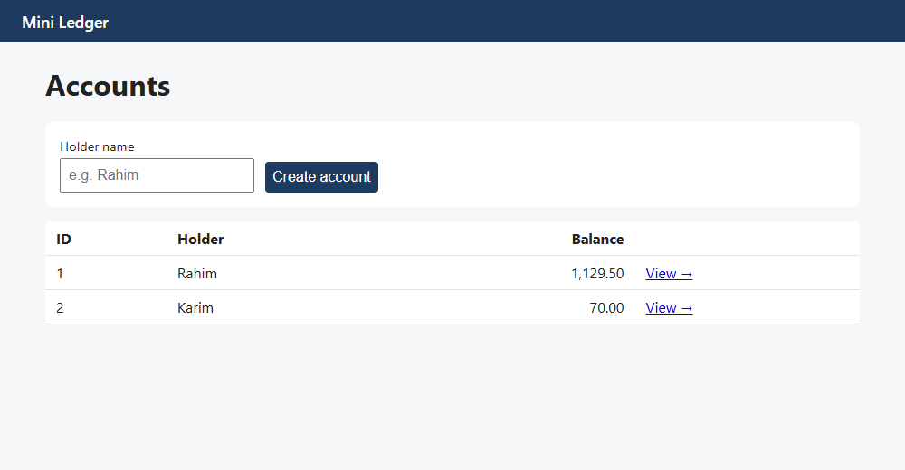
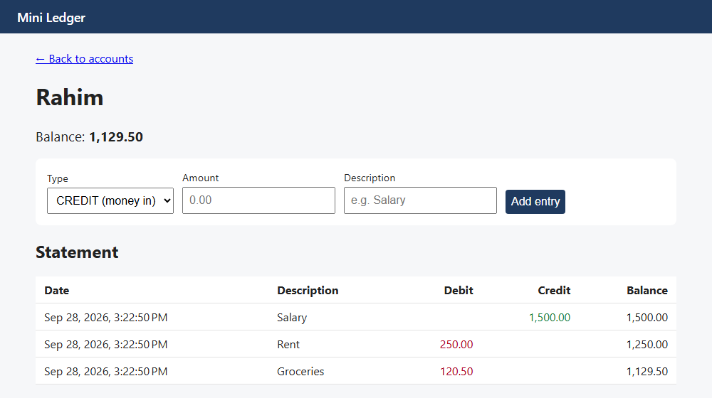
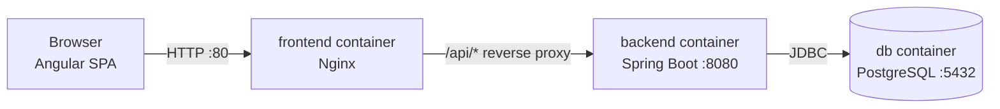

# Mini Transaction Ledger

A small full-stack app for keeping a ledger of accounts. You can create accounts, record CREDIT (money in) and DEBIT (money out) entries, and see a statement with the running balance after every entry.

Built with Angular, Spring Boot and PostgreSQL. Everything runs in Docker with one command.




## Features

- Create accounts and see all of them with their current balance
- Record credit and debit entries on an account
- Statement for each account (oldest first) with Debit, Credit and running Balance columns
- A debit bigger than the balance is rejected (no overdraft)
- Validation in the Angular forms and again in the API
- Error responses in the standard Problem Details format (RFC 9457)
- Entries can't be edited or deleted, the ledger is append-only
- Safe when two requests hit the same account at the same time (row lock)
- Swagger UI for the API

## Tech Stack

| Layer | Technology |
|---|---|
| Frontend | Angular 21 (TypeScript, signals, reactive forms) |
| Backend | Spring Boot 4.1, Java 25 |
| Database | PostgreSQL 17 |
| Data access | Spring Data JPA / Hibernate |
| Migrations | Flyway |
| Other backend libs | Lombok, springdoc-openapi (Swagger UI) |
| Tests | JUnit, Mockito, AssertJ |
| Frontend tooling | ESLint, Prettier |
| Web server | Nginx (serves the Angular build and proxies `/api`) |
| Containers | Docker, Docker Compose |

## Quick Start (Docker)

You only need Docker Desktop.

```bash
git clone https://github.com/human-netizen/mini-transaction-ledger.git
cd mini-transaction-ledger
docker compose up --build
```

Then open http://localhost

A `.env` file is not required, every setting has a default value. If you want to change the database password or the ports, copy `.env.example` to `.env` and edit it. For example, if port 80 is already used on your machine, set `FRONTEND_PORT=8081` and open http://localhost:8081.

`docker compose down` stops the containers and keeps the data. `docker compose down -v` also removes the database volume.

## Local Development

1. Start only the database: `docker compose up -d db` (PostgreSQL on `localhost:5431`)
2. Backend: `cd backend` and run `./mvnw spring-boot:run` (or run `LedgerApplication` from IntelliJ). API on http://localhost:8080
3. Frontend: `cd frontend`, `npm install`, then `npm start`. App on http://localhost:4200
4. Backend tests: `cd backend` and `./mvnw test` (the context test needs the database from step 1)
5. Frontend lint/format: `npm run lint` and `npm run format`

While developing, the Angular dev server forwards `/api/*` to `localhost:8080` (see `frontend/proxy.conf.json`). In Docker, Nginx does the same thing. So the frontend always calls relative URLs like `/api/accounts` and I didn't need any CORS config.

Swagger UI is at http://localhost:8080/swagger-ui.html when the backend runs locally. In Docker the backend port is not published, only `/api` is reachable through Nginx.

## Architecture



There are three containers. The frontend container runs Nginx, which serves the built Angular files and forwards `/api/*` requests to the backend. The backend is a Spring Boot app split into controller, service and repository layers, and it is only reachable from inside the Docker network. The database is PostgreSQL; Flyway creates the tables when the backend starts, and the data is kept in a named volume. The containers reach each other by service name (`backend`, `db`).

## API

Base path is `/api`.

| Method | Path | Body | Success | Errors |
|---|---|---|---|---|
| POST | `/api/accounts` | `{ "holderName": "Rahim" }` | 201 + account | 400 |
| GET | `/api/accounts` | - | 200 + list of accounts | - |
| GET | `/api/accounts/{id}` | - | 200 + account | 404 |
| POST | `/api/accounts/{id}/entries` | `{ "type": "DEBIT", "amount": 30.00, "description": "Rent" }` | 201 + entry | 400, 404, 422 |
| GET | `/api/accounts/{id}/entries` | - | 200 + list of entries (oldest first) | 404 |

Example account:

```json
{ "id": 1, "holderName": "Rahim", "balance": 70.00, "createdAt": "2026-09-25T10:15:30Z" }
```

Example entry:

```json
{ "id": 2, "type": "DEBIT", "amount": 30.00, "description": "Rent", "balanceAfter": 70.00, "createdAt": "2026-09-25T10:16:02Z" }
```

Example error (422):

```json
{ "type": "about:blank", "title": "Unprocessable Content", "status": 422,
  "detail": "Insufficient funds: balance is 70.00, debit is 1000", "instance": "/api/accounts/1/entries" }
```

400 is used when the request itself is invalid (blank name, negative amount, more than 2 decimals, bad JSON). Validation errors also include an `errors` object with a message per field. 404 is used for an unknown account id, also on the statement endpoint. 422 is used when the request is valid but the debit is bigger than the balance.

## How It Works

What happens when a user adds a debit:

```mermaid
sequenceDiagram
    actor User
    participant A as Angular (browser)
    participant N as Nginx
    participant C as LedgerEntryController
    participant S as LedgerService
    participant DB as PostgreSQL

    User->>A: Fill form, click "Add entry"
    A->>N: POST /api/accounts/1/entries (JSON)
    N->>C: forward to backend:8080
    C->>C: @Valid checks the request (400 if invalid)
    C->>S: recordEntry(1, request)
    S->>DB: BEGIN; SELECT account FOR UPDATE
    S->>S: check funds (422 if insufficient), compute new balance
    S->>DB: INSERT ledger_entries
    S->>DB: COMMIT (Hibernate flushes UPDATE accounts, lock released)
    S-->>C: EntryResponse
    C-->>A: 201 Created (JSON) via Nginx
    A->>A: reload account + statement
    A-->>User: new row and new balance shown
```

The running balance is stored, not calculated on every read. Every entry saves `balance_after`, and the account keeps its current `balance`. Both are written in the same transaction, so they always match.

To stop two debits from both passing the funds check at the same time, `recordEntry` loads the account with `SELECT ... FOR UPDATE`. The second request waits until the first one commits and then sees the new balance.

Money is `BigDecimal` in Java and `NUMERIC(19,2)` in the database, never `double`.

Errors: the services throw `AccountNotFoundException` or `InsufficientFundsException`, and a `@RestControllerAdvice` class turns them into 404 / 422 Problem Details. `@Valid` failures become 400. In Angular, `toErrorMessage()` reads the `detail` field and the page shows it.

More detail is in [docs/EXPLANATION.md](docs/EXPLANATION.md). The design I wrote before coding is in [docs/design.md](docs/design.md).

## Project Structure

```
backend/
  src/main/java/com/niloy/ledger/
    controller/    REST controllers
    service/       business logic and transactions
    repository/    Spring Data JPA repositories
    entity/        JPA entities
    dto/           request/response records
    exception/     custom exceptions and the global handler
  src/main/resources/
    application.properties
    db/migration/  Flyway SQL scripts
  src/test/java/   unit tests
  Dockerfile
frontend/
  src/app/
    models/        TypeScript interfaces for the API
    services/      HTTP services and error helper
    pages/         account-list, account-detail
  proxy.conf.json  dev proxy to the backend
  nginx.conf       Nginx config used in Docker
  Dockerfile
docs/              design, explanation, screenshots
docker-compose.yml
.env.example
```

## Design Decisions

| Decision | Why |
|---|---|
| `BigDecimal` / `NUMERIC(19,2)` | `double` can't store values like 0.1 exactly |
| No edit/delete for entries | A ledger is a history. A mistake is fixed with a new reversing entry |
| Stored running balance + row lock | Statements are cheap to read and stay correct with concurrent requests |
| DTOs instead of returning entities | The client can't set fields like `balance`, and no lazy-loading problems in JSON |
| Flyway + `ddl-auto=validate` | The schema is versioned SQL in Git, Hibernate only checks it |
| Proxy instead of CORS | The browser only talks to one origin, and the frontend code is the same everywhere |
| Settings from environment variables | Same jar locally and in Docker, and the real password stays in `.env` (git-ignored) |
| Backend runs as a non-root user, port not published | Smaller attack surface |

## Future Improvements

- Login with JWT
- Transfers between two accounts (one debit + one credit in one transaction)
- Pagination for long statements
- Integration tests with Testcontainers and controller tests with `@WebMvcTest`
- GitHub Actions to build, test and lint on every pull request
