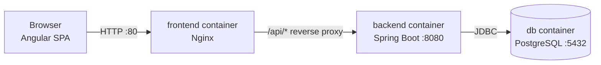
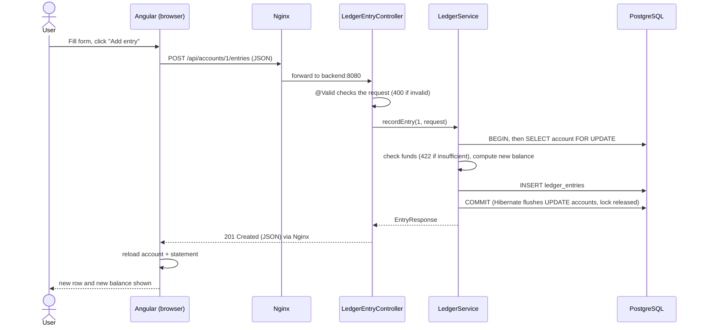

# Mini Transaction Ledger: How It Works

This document covers the four points asked for in the assessment: the architecture, the key code components, how the API works internally, and the Docker setup.

## 1. App architecture (frontend and backend interaction)



The app has three parts, each in its own container.

| Container | What runs in it | Job |
|---|---|---|
| `frontend` | Nginx with the built Angular app | Sends the HTML/JS/CSS to the browser and forwards `/api/*` to the backend |
| `backend` | Spring Boot jar (Java 25) | REST API, business rules, transactions |
| `db` | PostgreSQL 17 | Stores accounts and ledger entries |

The Angular app is a single-page application. The browser loads `index.html` and the JavaScript bundle once, and after that Angular draws the pages itself and only asks the backend for data. The frontend and backend only talk through JSON over HTTP, always under the `/api` prefix.

The browser only ever talks to one address (for example `http://localhost`). Nginx looks at the path: `/api/...` goes to `backend:8080`, everything else is served from the Angular build. Because the browser sees a single origin, CORS never comes into play. During development the Angular dev server does the same job with `proxy.conf.json`, so the Angular code uses the same relative URLs (`/api/accounts`) in both setups.

## 2. Key code components and their purpose

### Backend (`backend/src/main/java/com/niloy/ledger`)

The backend is layered: controller → service → repository → database. Each layer only calls the one below it.

| File | What it does and why it exists |
|---|---|
| `AccountController` | Endpoints for accounts: `POST /api/accounts`, `GET /api/accounts`, `GET /api/accounts/{id}`. It only turns HTTP into service calls. `@Valid` rejects bad input with 400 before the service runs. |
| `LedgerEntryController` | Endpoints for entries under an account: `POST` and `GET /api/accounts/{accountId}/entries`. The account id comes from the URL and the entry data from the body, so they can't conflict. |
| `AccountService` | Creates, lists and loads accounts. Returns `AccountResponse` DTOs so entities never leave the service. An unknown id throws `AccountNotFoundException`. |
| `LedgerService` | The main business logic. `recordEntry` locks the account row, refuses an overdraft, calculates the new balance with `BigDecimal`, updates the account and saves the entry with its `balanceAfter`, all in one transaction. `getStatement` checks that the account exists first, so a wrong id gives 404 instead of an empty list. |
| `AccountRepository` | Spring Data interface for `accounts`. Basic CRUD comes for free; I added `findByIdForUpdate`, which uses `@Lock(PESSIMISTIC_WRITE)` and becomes `SELECT ... FOR UPDATE`. |
| `LedgerEntryRepository` | Spring Data interface for `ledger_entries`. `findByAccountIdOrderByCreatedAtAscIdAsc` is a derived query: Spring builds the SQL from the method name. |
| `Account`, `LedgerEntry`, `EntryType` | JPA entities mapped to the two tables, and the CREDIT/DEBIT enum. `Account` only has a setter for `balance`. `LedgerEntry` has no setters at all because entries are never changed. The entry points to its account with `@ManyToOne(fetch = LAZY)`. |
| DTOs (`CreateAccountRequest`, `AccountResponse`, `CreateEntryRequest`, `EntryResponse`) | Java records that define the API contract. Request DTOs contain only what the client is allowed to send, with validation annotations (`@NotBlank`, `@Positive`, `@Digits(fraction = 2)`...). Response DTOs have a static `from(entity)` method. |
| `AccountNotFoundException`, `InsufficientFundsException` | Unchecked exceptions thrown by the services. Being `RuntimeException`s, they also make `@Transactional` roll back. |
| `GlobalExceptionHandler` | `@RestControllerAdvice` that turns exceptions into `ProblemDetail` responses: 404 for not found, 422 for insufficient funds, 400 with a per-field `errors` map for validation. |
| `V1__create_accounts_and_ledger_entries.sql` | Flyway migration that creates both tables with `NUMERIC(19,2)` money columns, `CHECK` constraints (balance >= 0, amount > 0, type is CREDIT or DEBIT), the foreign key and an index on `account_id`. |

### Frontend (`frontend/src/app`)

| File | What it does and why it exists |
|---|---|
| `models/*.model.ts` | TypeScript interfaces that mirror the backend DTOs, so typos in field names are caught at compile time. |
| `services/account.service.ts`, `services/ledger.service.ts` | Small wrappers around `HttpClient`, one method per endpoint, returning Observables. Pages never build URLs themselves. |
| `services/api-error.ts` | `toErrorMessage()` turns a failed request into a sentence for the user. It reads `detail` from the Problem Details body, and handles status 0 (backend not reachable). |
| `pages/account-list` | Lists accounts and has the "create account" form. |
| `pages/account-detail` | Reads the account id from the URL, loads the account and its statement, and has the "add entry" form. |
| `app.routes.ts` | `/accounts` → list, `/accounts/:id` → detail, anything else → `/accounts`. |

Both pages keep their state in signals (`accounts`, `entries`, `errorMessage`, `submitting`), so Angular updates the view when the data arrives. The forms are reactive forms with the same rules as the backend (required, max length, amount at least 0.01) for quick feedback. The `submitting` signal disables the button while a request is running, so a double click can't record the same debit twice. After a successful change the page reloads the data from the server instead of changing the list locally, so the screen always shows what is really in the database.

## 3. How the API works internally

Example request: `POST /api/accounts/1/entries` with `{"type":"DEBIT","amount":30,"description":"Rent"}` on an account whose balance is 100.00.



Step by step inside the backend:

1. Tomcat (embedded in Spring Boot) receives the request and passes it to Spring MVC's `DispatcherServlet`.
2. The `DispatcherServlet` matches `POST /api/accounts/{accountId}/entries` to `LedgerEntryController.recordEntry`.
3. Jackson converts the JSON body into a `CreateEntryRequest` record. `"DEBIT"` becomes `EntryType.DEBIT`. An unknown type like `"FOO"` can't be converted, so Spring answers 400.
4. `@Valid` runs the validation annotations. If something is wrong (negative amount, 3 decimals, blank description), Spring throws `MethodArgumentNotValidException` and the handler returns 400. The service is never called.
5. The controller calls `ledgerService.recordEntry(1, request)`. The call goes through a Spring proxy, which starts a database transaction because of `@Transactional`.
6. `findByIdForUpdate(1)` runs `SELECT ... FROM accounts WHERE id = 1 FOR UPDATE`. The row is now locked until the transaction ends. If there is no account, `AccountNotFoundException` is thrown.
7. The funds check: for a DEBIT, if the balance is less than the amount, `InsufficientFundsException` is thrown before anything is changed. A debit of exactly the whole balance is allowed.
8. The new balance is calculated (100.00 - 30 = 70.00) and set on the account object. There is no `save(account)` call: the account was loaded in this transaction, so Hibernate tracks it and writes the `UPDATE` at commit (dirty checking).
9. A new `LedgerEntry` with `balanceAfter = 70.00` is saved, which runs the `INSERT`.
10. The method returns, the proxy commits. Both the `UPDATE accounts` and the `INSERT` are saved together, and the lock is released. If any exception was thrown, the proxy rolls back instead and nothing is saved.
11. The entity is converted to an `EntryResponse` inside the service (while the Hibernate session is still open), the controller returns it with status 201 (`@ResponseStatus(CREATED)`), and Jackson writes the JSON.

Why the lock matters: without it, two debits of 80 on a balance of 100 could both read 100, both pass the check and both write 20. With `FOR UPDATE` the second request waits at step 6 until the first commits, then reads 20 and gets a 422.

The database also has its own `CHECK (balance >= 0)` and `CHECK (amount > 0)` constraints. The Java code should never hit them, but they are there as a last line of defense if a bug skips the checks.

Errors all come out in the same shape (Problem Details, RFC 9457):

```json
{ "type": "about:blank", "title": "Unprocessable Content", "status": 422,
  "detail": "Insufficient funds: balance is 70.00, debit is 1000", "instance": "/api/accounts/1/entries" }
```

| Exception | Where it comes from | Status |
|---|---|---|
| `MethodArgumentNotValidException` | `@Valid` in the controller | 400 (with `errors` per field) |
| `AccountNotFoundException` | services | 404 |
| `InsufficientFundsException` | `LedgerService.recordEntry` | 422 |
| anything else | a bug | 500 |

When the backend starts, Flyway runs any new migration scripts first, then Hibernate checks that the entities match the tables (`ddl-auto=validate`). If they don't match, the app refuses to start.

## 4. Docker setup explanation

`docker compose up --build` builds two images and starts three containers on one private network.

### backend/Dockerfile

A multi-stage build:

- Stage 1 uses the `maven:3.9-eclipse-temurin-25` image. It copies `pom.xml` first and downloads the dependencies, then copies `src` and runs `mvn package -DskipTests`. Copying `pom.xml` separately means the dependency layer is cached and only rebuilt when the pom changes, not on every code change. Tests are skipped here because they run locally, and the context test needs a database that doesn't exist during the image build.
- Stage 2 uses the smaller `eclipse-temurin:25-jre` image and only copies the jar from stage 1. There is no JDK, Maven or source code in the final image.
- The container runs as a normal user called `spring` instead of root.

### frontend/Dockerfile and nginx.conf

Also two stages. Stage 1 (`node:24-alpine`) runs `npm ci` and `npm run build`. Stage 2 (`nginx:alpine`) gets only the built files from `dist/frontend/browser` plus my `nginx.conf`. Node is not in the final image.

`nginx.conf` has two locations:

- `/api/` is forwarded with `proxy_pass http://backend:8080`. There is no trailing slash, so the path `/api/...` is passed unchanged. `backend` is the Compose service name.
- `/` serves the static files, with `try_files $uri $uri/ /index.html`. When someone refreshes on `/accounts/1` there is no such file, so Nginx returns `index.html` and the Angular router shows the right page.

The `.dockerignore` files keep `node_modules`, `dist`, `.angular` and `target` out of the build context, so local build output (and Windows-specific packages) never get copied into the Linux image.

### docker-compose.yml

- `db` uses the official `postgres:17-alpine` image, stores its data in the `db-data` volume and has a healthcheck with `pg_isready`.
- `backend` is built from `./backend` and waits for `db` to be healthy (`depends_on` with `condition: service_healthy`), not just started. It gets the database settings from environment variables like `SPRING_DATASOURCE_URL=jdbc:postgresql://db:5432/ledger`. Spring Boot maps these to `spring.datasource.url` and they override `application.properties`, so the same jar works on my machine (`localhost:5431`) and in Docker (`db:5432`). The backend has no published port; only Nginx can reach it.
- `frontend` is built from `./frontend` and is the only service the browser needs. Port 80 is published (configurable with `FRONTEND_PORT`).
- The database password and names come from a `.env` file (git-ignored) with defaults in the compose file, so a fresh clone still runs without any setup. `.env.example` lists the available settings.
- All services use `restart: unless-stopped`.
- The `db` port is also published on `5431` so I can connect from IntelliJ and run the backend outside Docker during development.

Inside the network the containers find each other by service name through Docker's built-in DNS, which is why the backend uses `db` as the host name and Nginx uses `backend`.
